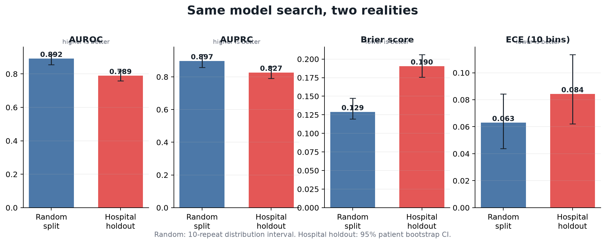
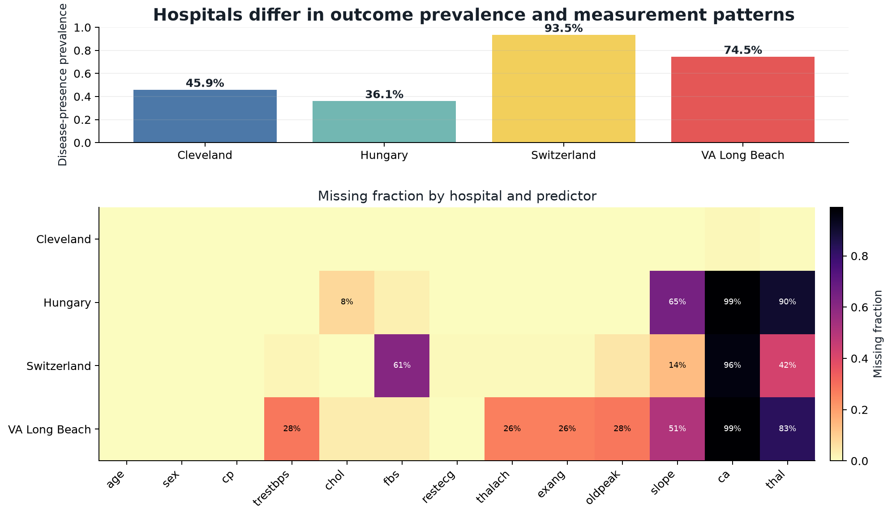
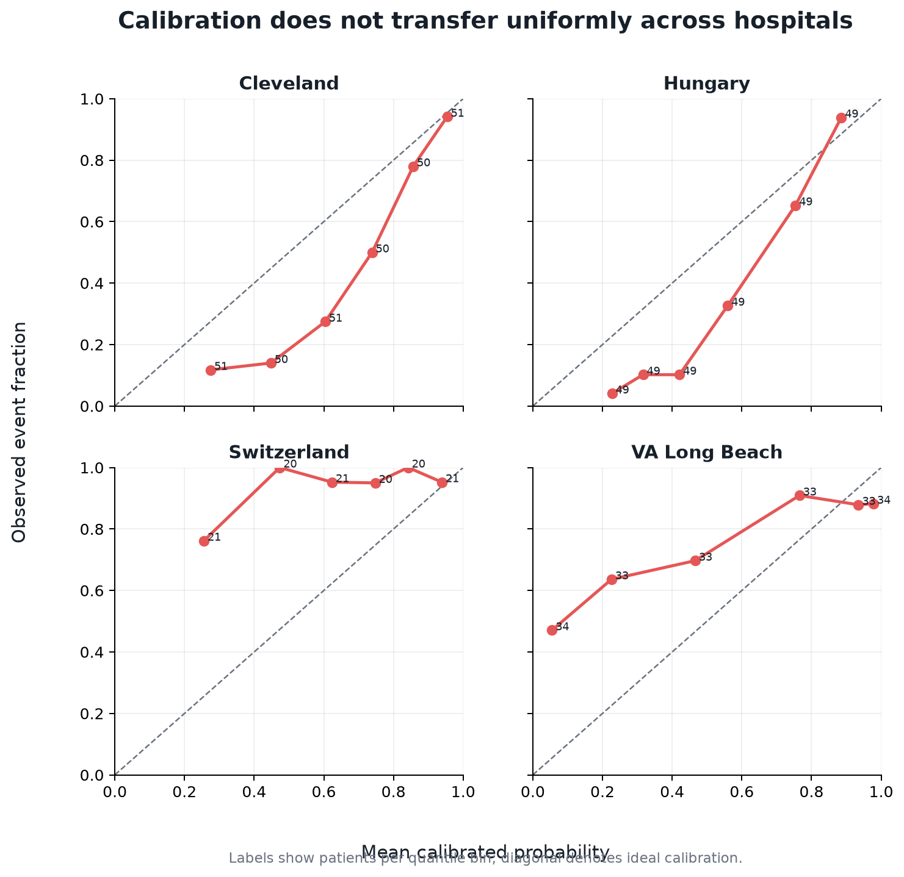
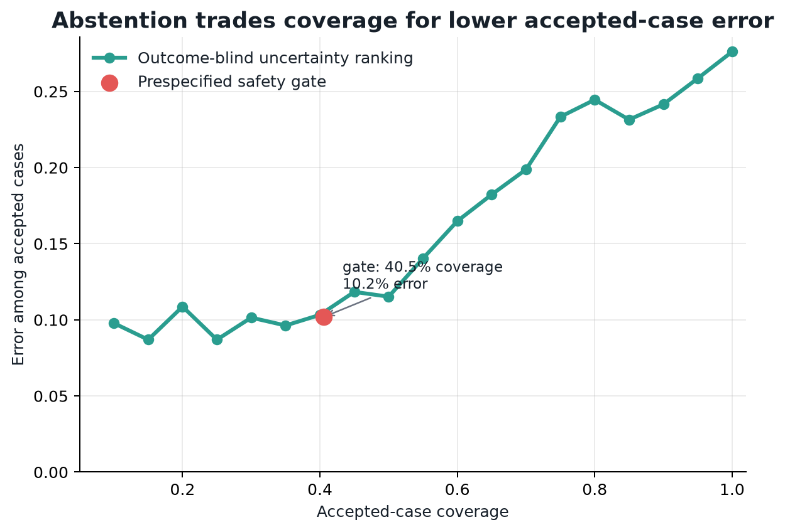
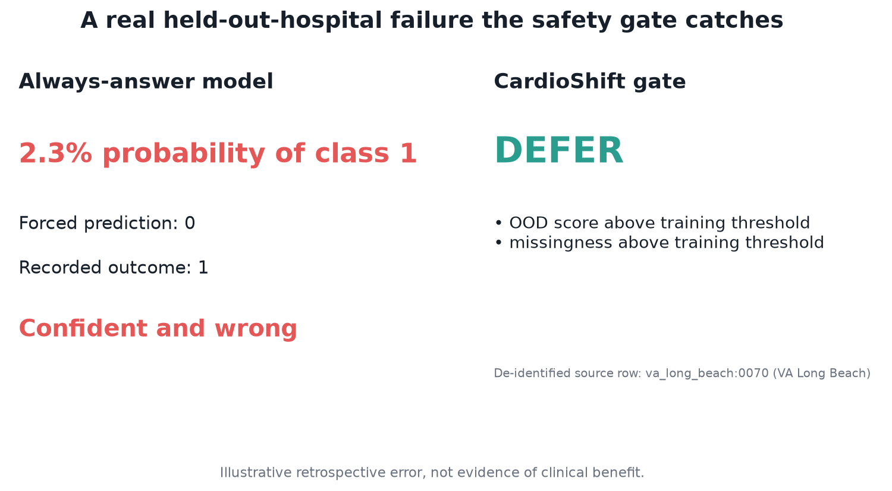

# CardioShift: Know When Not to Predict

## A leakage-resistant four-hospital benchmark of calibration and selective prediction

### Abstract

Random patient splitting can evaluate interpolation within a mixture of data
sources rather than transport to a new hospital. We compared 10 repeated
stratified random splits with four leave-one-hospital-out (LOHO) evaluations on
920 records from the UCI Heart Disease collection. Every outer fold restricted
preprocessing, model selection, calibration, conformal quantiles, OOD thresholds,
and abstention thresholds to the three training hospitals. Mean random-split
AUROC was 0.892; pooled LOHO AUROC was
0.789 (95% patient bootstrap CI
0.758–0.818), an optimism gap of
0.102. A separate site classifier achieved
balanced accuracy 0.911, supporting
substantial source shift. A prespecified safety gate accepted
40.5% of external cases with accepted-case
error 10.2% (95% CI
7.3%–13.3%).
However, the gate deferred most cases, and empirical conformal coverage fell to
78.0% in
VA Long Beach. CardioShift therefore shows
both the scale of random-split optimism and the limits of algorithmic
abstention under real hospital shift.

### 1. Clinical question and intended use

The research question is not whether another classifier can improve internal
accuracy. It is whether performance, calibration, and confidence transfer when
the test hospital is absent from every model-development decision. The intended
use is retrospective methods research and education. The endpoint is recorded
angiographic disease presence status; it is not future cardiovascular risk.

### 2. Data

The analysis uses Cleveland (303 records), Hungary (294), Switzerland (123), and
VA Long Beach (200). The combined cohort contains 920 records and 509 positive
labels. Original missing values were retained. Hospital prevalence ranged from
36.1% to 93.5%, while the fraction of missing predictor cells ranged from 0.15%
to 26.85%. Four exact duplicate rows were reported and retained.

### 3. Validation protocol

The primary design was four-fold LOHO validation. Within each outer training
set, candidate logistic regression, random forest, and histogram gradient
boosting configurations were compared by leave-one-training-hospital-out mean
Brier score, with AUROC and simplicity as tie-breakers. Numeric and categorical
imputation, scaling where applicable, and encoding were fitted inside each
training fold. The `site` field and all identifiers and outcomes were excluded
from predictor matrices.

Sigmoid calibration used group-OOF probabilities from the three training
hospitals. Patient-level predictions and exact tuning, calibration, and final-fit
ID ledgers were saved. Metrics used 2,000 patient bootstrap resamples.

### 4. Random splitting versus hospital holdout

Across repeated random splits, mean AUROC was
0.892 and mean Brier score was
0.129. Pooled LOHO AUROC was
0.789, and Brier score worsened to
0.190. Pooled LOHO sensitivity was
79.8%, specificity 63.3%, and
ECE 0.084. The four held-out-hospital AUROCs ranged from
0.727 to 0.891.

These results support a narrower conclusion than “random splits are invalid.”
In this four-source dataset, random patient splitting produced substantially
more optimistic estimates than hospital-level external validation.

### 5. Evidence of dataset shift

Hospital identity was predicted from patient predictors and missingness with
5-fold OOF balanced accuracy 0.911
versus balanced chance 0.25. This does not
establish the causes of shift, but it demonstrates that the recorded source
distributions are strongly distinguishable.

### 6. Calibration

Calibration varied sharply by held-out hospital even after training-only sigmoid
calibration. Per-hospital ECE ranged from approximately 0.186 to 0.289. This
motivates reporting probability quality separately from ranking performance.

### 7. Selective prediction

The prespecified gate deferred cases when any of four training-derived signals
triggered: OOD score, ambiguity band, non-singleton or empty conformal set, or
excessive missingness. It accepted 40.5% of
LOHO cases. Accepted-case error was
10.2%; accepted-case false-negative
rate was 7.5%.

This improvement cannot be interpreted without the
59.5% deferral rate. The gate trades
coverage for lower error among accepted cases; it does not prove clinical safety.

### 8. Conformal and OOD limitations

Overall empirical conformal coverage was
90.4%, but
VA Long Beach reached only
78.0%. Exchangeability
does not automatically survive a hospital shift. The OOD detector also used an
outer-training in-sample threshold, which can under-detect subtle changes.

### 9. Failure case

The held-out predictions contain real high-confidence errors. The safety gate
catches some through OOD, conformal, ambiguity, or missingness triggers, but not
all. The case visual is illustrative and does not imply patient benefit.

### 10. Limitations

- Historical, small, non-contemporary data from the 1980s.
- Site outcome prevalence and missingness are extreme in some hospitals.
- The target is recorded angiographic disease presence, not a future event.
- No prospective clinical deployment or decision-impact study was performed.
- The safety gate defers a majority of cases at its prespecified operating point.
- Conformal coverage is empirical only under hospital shift; exchangeability is not assured.
- The IsolationForest threshold uses an outer-training in-sample score quantile and may under-detect subtle shift.
- Missingness and subgroup stress tests are descriptive and do not establish clinical robustness or fairness.
- Results do not support diagnosis, treatment, medication, or real-patient use.

### 11. Conclusion

Random patient splitting overstated cross-hospital performance in this
four-center benchmark. Training-only calibration and abstention reduced error
among accepted cases but at the cost of deferring most cases, and conformal
coverage remained fragile in the most shifted hospital. The practical lesson is
not that uncertainty tools guarantee safety; it is that a model should be
evaluated where it is expected to fail, and allowed to expose uncertainty rather
than forced to answer every time.
